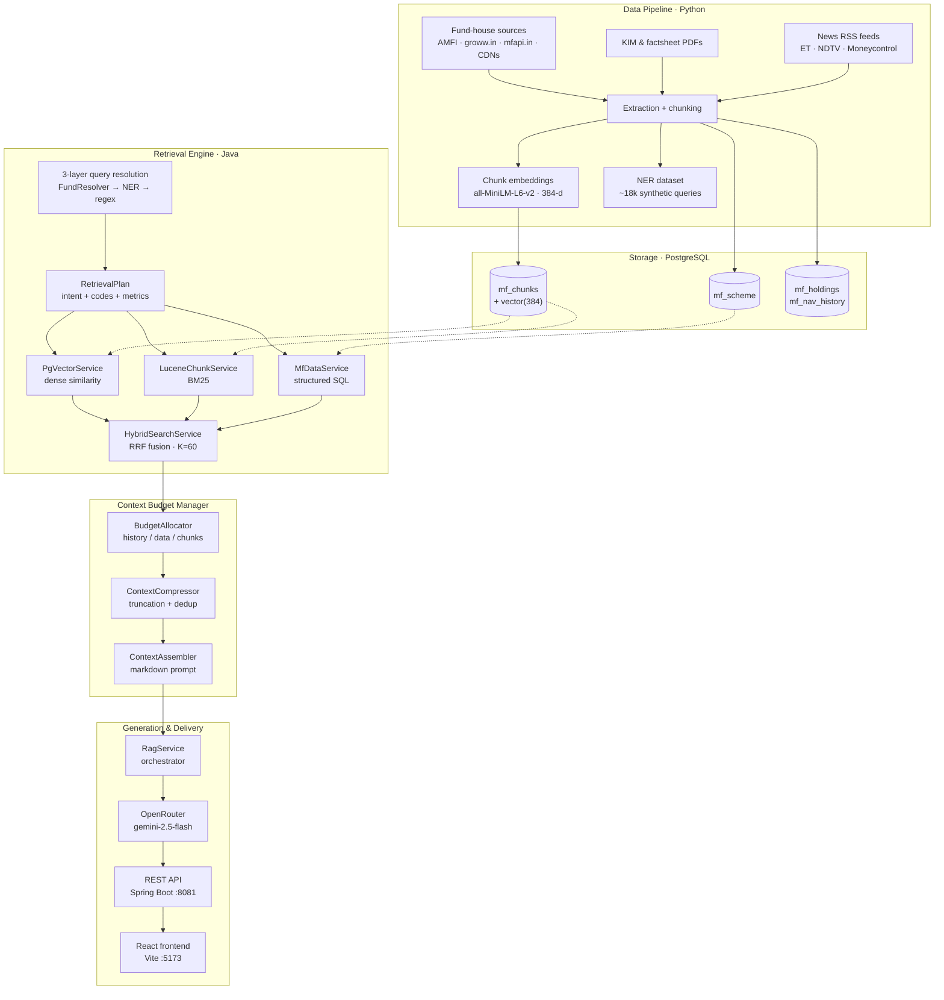
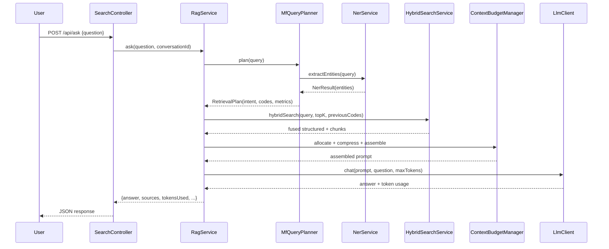
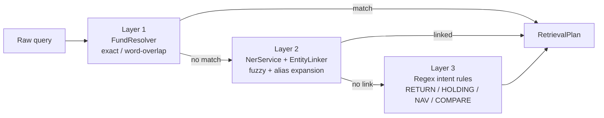
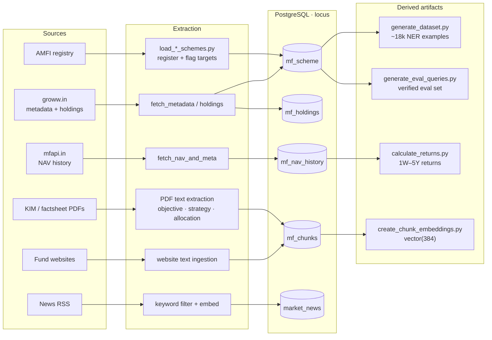

# Locus — Hybrid Retrieval & Context Assembly Engine

**Locus** is a domain-specific retrieval and context-assembly
platform for Indian mutual funds. It fuses three retrieval strategies — dense
vector search, sparse keyword search, and structured SQL lookup — into a single
ranked result set, then assembles the retrieved material into a token-budgeted
prompt for a large language model.

The project is a retrieval-infrastructure exercise. Its central engineering question is:

> Given a finite LLM context window, how do you select, compress, and format the
> most relevant information — across heterogeneous sources and conversation
> history — to maximize answer quality while minimizing token consumption?

This is **Context Budget Management**, and it is the organising concern of the
entire codebase.

---

## Table of Contents

1. [Highlights](#highlights)
2. [System Architecture](#system-architecture)
3. [Query Resolution Pipeline](#query-resolution-pipeline)
4. [Data Pipeline](#data-pipeline)
5. [NER Fine-Tuning](#ner-fine-tuning)
6. [Core Components](#core-components)
7. [Technology Stack](#technology-stack)
8. [Repository Structure](#repository-structure)
9. [Setup & Running](#setup--running)
10. [API Reference](#api-reference)
11. [Frontend](#frontend)
12. [Evaluation & Metrics](#evaluation--metrics)
13. [Measured Results](#measured-results)
14. [Future Scope](#future-scope)
15. [Known Limitations](#known-limitations)
16. [License](#license)

---

## Highlights

- **Context Budget Management** — the central novel contribution. A
  `ContextBudgetAllocator` partitions a finite token budget across conversation
  history, structured data tables, and retrieved text chunks based on query
  intent; a `ContextCompressor` then fits the retrieved material into its
  allocation, and a `ContextAssembler` renders it into a token-efficient
  markdown prompt.
- **Three-layer query resolution** — a cascade of exact fund-name matching,
  neural-entity linking, and regex intent rules that turn a free-text question
  into a structured `RetrievalPlan` (intent + scheme codes + metric types).
- **Hybrid retrieval fusion** — dense `pgvector` search, Lucene BM25 keyword
  search, and structured SQL retrieval merged via Reciprocal Rank Fusion (RRF).
- **Fine-tuned local NER** — a `bert-base-uncased` token-classification model
  fine-tuned in Google Colab on a custom 19-label BIO scheme (fund, AMC,
  company, index, sector, metric, period, date, category), exported to ONNX,
  and served through ONNX Runtime with zero external API calls.
- **Full data pipeline** — a multi-source Python ingestion pipeline (AMFI,
  groww.in, mfapi.in, fund-house CDNs, KIM/factsheet PDFs, RSS news) covering
  five fund houses, plus synthetic NER dataset generation (~18k examples),
  embedding generation, and return computation.
- **Evaluation harness** — a database-verified query generator and a 13-metric
  evaluation framework spanning retrieval quality, context sufficiency, answer
  grounding, and source efficiency.
- **Conversation memory** — in-memory multi-turn state with token-budgeted
  history inclusion and expiry.
- **Wired full-stack UI** — a React frontend connected to the backend over
  `POST /api/ask`, with source citations, a token-budget indicator, and a
  context inspector.
- **Database-backed authentication** — email/password registration and login
  with BCrypt, JWT access tokens, rotating HttpOnly refresh cookies, logout,
  and Google OAuth2 sign-in.

---

## System Architecture

The pipeline is a linear flow of seven stages: ingestion, dual-store indexing,
query understanding, hybrid retrieval, context budgeting, generation, and
delivery.



### Request Flow



---

## Query Resolution Pipeline

Locus resolves a free-text question into a structured `RetrievalPlan` through a
three-layer cascade. Each layer is a fallback for the one before it, so a query
is matched by the most precise mechanism that can handle it.



| Layer | Component | Strategy |
|-------|-----------|----------|
| 1 | `FundResolver` | In-memory map of all target funds; word-overlap matching (fund-house prefix required, at least two matched words, ratio ≥ 0.85). |
| 2 | `NerService` + `EntityLinker` | ONNX BERT extracts `FUND`/`METRIC` entities; `EntityLinker` expands aliases (`fc` → "flexi cap"), then fuzzy-matches (token-set similarity ≥ 0.7 + Levenshtein ≤ 2 edits). |
| 3 | `MfQueryPlanner` regex | Five compiled patterns (`RETURN`, `HOLDING`, `NAV`, `COMPARE`, `FUND_FACTS`) classify intent and metric types. |

**Intents:** `COMPARE_FUNDS`, `HOLDINGS`, `FUND_DETAILS`, `NAV`, `GENERAL`.

---

## Core Components

### 1. Context Budget Manager

The novel contribution of the project. It divides the finite context window into
three competing budgets — **history**, **structured data**, and **text chunks** —
and allocates tokens among them based on query intent and available material.

| Component | Responsibility |
|-----------|----------------|
| `ContextBudgetAllocator` | Partitions a 6000-token budget. History gets 25% when present; the data/chunk split is intent-driven (NAV/details/compare → 60/40, holdings → 70/30, general → 50/50), reallocating when one side is empty. |
| `ContextCompressor` | Fits retrieved material into its allocation — sorts chunks by similarity, truncates to sentence boundaries via binary search, and skips non-text keys in the token estimate. |
| `ContextAssembler` | Renders fund details, a period-pivoted returns table, a holdings table, relevant documents, conversation history, and the user question into a structured markdown prompt. |

### 2. Hybrid Retrieval

| Component | Responsibility |
|-----------|----------------|
| `PgVectorService` | Dense similarity search over `mf_chunks.embedding` (384-dim) using the `<=>` operator, with optional scheme-code filtering. |
| `LuceneChunkService` | BM25 keyword search over a startup-built in-memory index (`ChunkAnalyzer`: standard tokenizer + lowercase + stop-words). |
| `MfDataService` | Structured SQL retrieval (`JdbcTemplate`) of fund details, returns, NAV history, and top holdings. |
| `HybridSearchService` | Runs the three retrievals as parallel `CompletableFuture`s and fuses them via Reciprocal Rank Fusion (`K = 60`). |

### 3. Query Understanding

| Component | Responsibility |
|-----------|----------------|
| `MfQueryPlanner` | Three-layer query resolution (see above); emits `RetrievalPlan(textQuery, schemeCodes, intent, metricTypes)`. |
| `NerService` | Runs the fine-tuned BERT token-classification model via ONNX Runtime + DJL tokenizer, aggregates BIO spans, and returns `NerResult` with confidence. |
| `FundResolver` | Startup-loaded map of target funds with word-overlap matching. |
| `EntityLinker` | Alias expansion + fuzzy matching with Levenshtein distance. |

### 4. Embedding & Generation

| Component | Responsibility |
|-----------|----------------|
| `EmbeddingService` | Loads `all-MiniLM-L6-v2.onnx` and its tokenizer, runs ONNX, mean-pools (mask-aware) and L2-normalizes token embeddings into 384-dim vectors. |
| `RagService` | Orchestrator: conversation management → plan → retrieve → budget → compress → assemble → generate → persist history. |
| `LlmClient` / `OpenRouterClient` | Provider-agnostic LLM abstraction; the OpenRouter client POSTs to a configurable OpenAI-compatible endpoint. |
| `TokenCounter` | Real tokenization via `jtokkit` (O200K_BASE), calibrated (`1.13×count + 5`) against provider-reported counts. |

### 5. Conversation Memory

| Component | Responsibility |
|-----------|----------------|
| `ConversationService` | In-memory `ConcurrentHashMap` state with 24-hour TTL and a 50-turn cap. |
| `MemoryManager` | Selects the last 3 turns for the prompt and truncates to the history budget when needed. |
| `Message` / `ConversationState` | Turn records carrying role, content, scheme codes, and citations. |

### 6. Evaluation Harness

See [Evaluation & Metrics](#evaluation--metrics).

---

## Data Pipeline

The Python pipeline (`data_pipeline/`) is the ingestion backbone of Locus. It
pulls Indian mutual-fund data from heterogeneous public sources, normalizes it
into PostgreSQL, and derives three downstream artifacts: chunk embeddings, the
NER training dataset, and the evaluation-query set.

### Data sources

| Source | What is extracted | Used by |
|--------|-------------------|---------|
| AMFI scheme master list | Official scheme registry (code, name, AMC, category) | `hdfc/load_amfi_schemes.py` |
| groww.in (`https://groww.in/mutual-funds/`) | Scheme metadata, expense ratio, exit load, fund managers, benchmark, AUM, portfolio holdings | all `fetch_metadata_*.py`, `fetch_holdings_*.py` |
| mfapi.in (`https://api.mfapi.in`) | Full NAV history per scheme | all `fetch_nav_and_meta_*.py` |
| HDFC CDN (`https://files.hdfcfund.com`) | KIM PDFs and fund-factsheet PDFs | `hdfc/fetch_kim.py`, `hdfc/fetch_fund_facts.py` |
| PPFAS KIM PDFs | Investment objective, asset allocation, strategy, risk profile | `ppfas/fetch_kim_ppfas.py` |
| PPFAS website | Fund philosophy, target persona, anti-persona text | `ppfas/ingest_website_info.py` |
| SBI KIM documents (by category) | Objective, strategy, asset allocation per scheme | `sbi/inject_sbi_kim.py` + `kim_*.json` |
| Curated unstructured text | ICICI portfolio commentary and market outlook | `icici/icici_unstructured.json` + `inject_icici_unstructured.py` |
| News RSS feeds | ET Mutual Funds, ET Markets, Moneycontrol Top News, NDTV Business — filtered by ~70 finance keywords, embedded | `news/fetch_news.py` |

### Pipeline flow



### Fund houses

| Folder | Sources | Extracts |
|--------|---------|----------|
| `hdfc/` | AMFI, groww.in, mfapi.in, HDFC CDN | schemes, metadata, NAV, holdings, KIM PDFs, factsheet PDFs |
| `icici/` | groww.in, mfapi.in, curated JSON | schemes, metadata, NAV, holdings, unstructured commentary |
| `nippon/` | groww.in, mfapi.in | schemes, metadata, NAV, holdings |
| `ppfas/` | groww.in, mfapi.in, KIM PDFs, website | schemes, metadata, NAV, holdings, philosophy/persona text |
| `sbi/` | groww.in, mfapi.in, KIM JSON (by category) | schemes, metadata, NAV, holdings, KIM objective/strategy/allocation |

Each fund house ships slug/name/URL override files (`manual_slugs*.json`,
`manual_kim_*.json`, `manual_pdf_names.json`) that map scheme names to the
correct groww.in slugs and CDN document names — the resolution layer for the
inconsistent naming schemes used across fund houses.

### Embedding & returns

- `create_chunk_embeddings.py` — generates 384-dim `all-MiniLM-L6-v2` embeddings
  for `mf_chunks` rows missing them (batches of 100).
- `calculate_returns.py` — computes 1W/1M/3M/6M/1Y/3Y/5Y returns from NAV
  history, with annualization for periods ≥ 1 year.

### News

- `news/fetch_news.py` — scheduled RSS fetcher (ET/NDTV/Moneycontrol) with
  keyword filtering and embedding.
- `news/news_retreival.py` — semantic news retrieval helper.

### Evaluation queries

- `generate_eval_queries.py` — generates the evaluation set from the database,
  verifying every query against actual data before writing.
- `validate_eval.py` — validates that every expected fund code matches the fund
  name words in its query.

> Screenshot placeholder: data pipeline / ingestion flow

---

## NER Fine-Tuning

Locus serves a **fine-tuned** named-entity-recognition model rather than an
off-the-shelf one.

### Dataset

- `generate_dataset.py` synthesizes ~18,000 natural-language queries from the
  database, each annotated with entity spans (fund names, sectors, metrics,
  periods, and so on).
- `create_to_bio.py` tokenizes the spans into the custom **19-label BIO scheme**
  (O + B-/I- for `FUND`, `AMC`, `COMPANY`, `INDEX`, `SECTOR`, `METRIC`,
  `PERIOD`, `DATE`, `CATEGORY`).
- `split_dataset.py` splits the tokenized set into train/val/test (80/10/10,
  seed 42).

### Training

- **Base model:** `google-bert/bert-base-uncased` with a token-classification
  head (`num_labels = 19`).
- **Framework:** Hugging Face `Trainer` in Google Colab.
- **Configuration:** 5 epochs, learning rate 2e-5, batch size 16, weight decay
  0.01, mixed precision (`fp16`).
- **Metrics:** `seqeval` precision, recall, F1, and accuracy, evaluated per
  epoch; the best checkpoint is selected by F1.

### Deployment

The best checkpoint is exported to ONNX and committed under
`backend/models/ner/` (`model.onnx`, tokenizer, and `labels.json`). At runtime,
`NerService` loads it via ONNX Runtime 1.19.2, tokenizes with the DJL
HuggingFace tokenizer, aggregates BIO spans, and returns typed entities with
confidence — entirely on-device, with no external API calls.

> Screenshot placeholder: NER training metrics from Colab

---

## Technology Stack

| Layer | Technology |
|-------|------------|
| Language | Java 21 |
| Framework | Spring Boot 3.2.6 (Web, WebFlux, Data JPA, JDBC) |
| Build | Maven |
| Database | PostgreSQL + `pgvector` extension |
| Vector store | `pgvector` (384-dim, `all-MiniLM-L6-v2` embeddings) |
| Full-text index | Apache Lucene 9.11.0 |
| Tokenizer | `jtokkit` 1.1.0 (O200K_BASE encoding) |
| NER inference | ONNX Runtime 1.19.2 (fine-tuned `bert-base-uncased`, 19 labels) |
| Tokenizer bindings | DJL HuggingFace tokenizers 0.34.0 |
| LLM | OpenRouter (`google/gemini-2.5-flash`) via OpenAI-compatible API |
| Frontend | React 18 + Vite 5 + TypeScript |
| Pipeline | Python (psycopg2, sentence-transformers, feedparser, pdfplumber) |

---

## Repository Structure

```
Locus/
├── backend/                       # Spring Boot application (port 8081)
│   ├── pom.xml
│   ├── models/ner/                # ONNX NER model + tokenizer + labels (19)
│   ├── index/                     # Lucene FSDirectory (build artifact — gitignored)
│   └── src/main/
│       ├── java/com/lazyfetch/locus/
│       │   ├── search/
│       │   │   ├── pgvector/      # dense vector search
│       │   │   ├── lucene/        # BM25 index + analyzer
│       │   │   ├── hybrid/        # RRF fusion
│       │   │   ├── data/          # MfDataService + FundResolver + EntityLinker
│       │   │   ├── planner/       # 3-layer query resolution
│       │   │   ├── context/       # budget allocator / compressor / assembler
│       │   │   ├── embedding/     # all-MiniLM-L6-v2 ONNX inference
│       │   │   ├── rag/           # orchestrator
│       │   │   ├── llm/           # provider abstraction
│       │   │   ├── tokens/        # token counting (jtokkit)
│       │   │   ├── ner/           # ONNX NER service
│       │   │   ├── conversation/  # memory + history
│       │   │   └── engine/        # legacy document search engine
│       │   ├── eval/              # evaluation harness
│       │   ├── data/mf/           # JPA entities + repositories
│       │   └── Filters/           # custom Lucene analyzers
│       └── resources/
│           ├── application.properties
│           ├── eval_queries.json        # full evaluation set
│           └── eval_queries_llm.json    # curated LLM-eval subset
├── data_pipeline/                 # Python ingestion + dataset generation
│   ├── hdfc/  icici/  nippon/  ppfas/  sbi/  news/
│   ├── config.json                # DB + source endpoints (groww, mfapi, CDN)
│   ├── generate_dataset.py        # NER span dataset (~18k examples)
│   ├── raw_dataset.jsonl          # synthetic queries with entity spans
│   ├── create_to_bio.py           # BIO tokenization (19 labels)
│   ├── split_dataset.py           # train/val/test split
│   ├── train.jsonl / val.jsonl / test.jsonl
│   ├── create_chunk_embeddings.py # vector generation
│   ├── calculate_returns.py       # returns computation
│   └── generate_eval_queries.py   # eval-query generation
├── frontend/                      # React + Vite UI (wired to /api/ask)
├── models/                        # embedding model (all-MiniLM-L6-v2.onnx)
└── idea.md                        # original design document
```

---

## Setup & Running

### Prerequisites

- Java 21
- Maven 3.9+
- PostgreSQL with the `pgvector` extension enabled
- Node.js 18+ and npm
- An OpenRouter API key

### 1. Database

Create the database and enable `pgvector`:

```sql
CREATE DATABASE locus;
CREATE EXTENSION IF NOT EXISTS vector;
```

Load the schema and data using the scripts in `data_pipeline/` (each fund house
has a `load_*_schemes.py` and `fetch_*` module). The `mf_chunks` table must be
populated with 384-dimensional embeddings before the backend can serve queries.

### 2. Environment

Set the following environment variables (or place them in a `.env` file — the
`spring-dotenv` dependency loads it automatically):

```
DB_URL=jdbc:postgresql://localhost:5432/locus
DB_USERNAME=postgres
DB_PASSWORD=root
OPENROUTER_API_KEY=<your-key>
```

### 3. Backend

```bash
cd backend
mvn clean spring-boot:run
```

The application starts on port **8081**. The Lucene BM25 index is rebuilt from
`mf_chunks` at startup.

### 4. Frontend

```bash
cd frontend
npm install
npm run dev
```

The frontend proxies `/api` requests to the backend on port **8081**.

---

## API Reference

| Method | Endpoint | Description |
|--------|----------|-------------|
| `POST` | `/api/ask` | Full RAG query. Body: `{ "question": "...", "conversationId": "..." }` |
| `POST` | `/api/search` | Hybrid retrieval only. Body: `{ "query": "...", "topK": 5 }` |
| `POST` | `/index` | Index a raw document into the legacy search engine. |
| `GET` | `/search?q=&n=` | Legacy keyword search. |
| `GET` | `/test-pgvector?q=` | Dense vector search only. |
| `GET` | `/test-lucene?q=` | BM25 search only. |
| `GET` | `/test-lucene-filtered?q=&code=` | BM25 filtered by scheme code. |
| `GET` | `/test-plan?q=` | Inspect the query planner's output. |
| `GET` | `/test-prompt?q=` | Inspect the assembled prompt + budget. |
| `GET` | `/test-ner?q=` | Inspect NER entity extraction. |
| `GET` | `/eval/baseline?useLucene=` | Run the retrieval evaluation harness. |
| `GET` | `/eval/llm` | Run the LLM-level evaluation (grounding + efficiency). |
| `GET` | `/eval/save?phase=` | Persist a snapshot to `eval_history.json`. |
| `GET` | `/eval/table` | Render the performance-evolution table. |
| `GET` | `/eval/compare?q=` | Compare Locus vs. a vanilla LLM prompt. |
| `GET` | `/debug-tokens-compare?q=` | Compare raw vs. calibrated token counts. |

---

## Frontend

The frontend is a React 18 + Vite 5 + TypeScript single-page application that
is fully wired to the backend — every chat message is sent to `POST /api/ask`
and the response (answer, sources, token usage) is rendered directly.

| Feature | Description |
|---------|-------------|
| Chat | Multi-conversation chat with markdown-style answers, auto-scroll, and an empty-state welcome screen. |
| Sources | Collapsible per-message source list, populated from the backend's `sources` field (section type + chunk text). |
| Token budget | Header indicator showing used vs. total context tokens (6000), with a warning state above 80%. |
| Context inspector | Side panel visualizing the token allocation across history / data / documents, plus extracted entities. |
| Conversations | Sidebar with create/delete/select and per-conversation token accounting. |
| Theming | Light/dark theme with persistence. |
| Auth | Database-backed email/password and Google OAuth2 authentication; the frontend keeps only the short-lived access token in session storage. |

The Vite dev server proxies `/api` requests to the Spring Boot backend on
port **8081** (`vite.config.js`).

> Screenshot placeholder: running frontend chat UI

---

## Authentication

The application includes database-backed authentication for the chat API.

### Email and password

- Registration validates the name, email, and an eight-character minimum password.
- Passwords are stored as BCrypt hashes in PostgreSQL; plaintext passwords are
  never persisted.
- Successful registration and login return a short-lived JWT access token.
- A cryptographically random refresh token is stored only as a SHA-256 hash in
  PostgreSQL and sent to the browser as an HttpOnly cookie.
- Refresh-token rotation revokes the previous token whenever a new access token
  is issued.

### Google OAuth2

Google login uses Spring Security's OAuth2 client flow. The backend links the
Google subject to an existing account by email or creates a new account, then
issues the same refresh-cookie and access-token session used by password login.

The frontend never stores a refresh token in JavaScript-accessible storage. The
short-lived access token is kept in `sessionStorage` and automatically renewed
through the HttpOnly cookie after a `401` response.

### Google Cloud configuration

1. Open [Google Cloud Console](https://console.cloud.google.com/).
2. Create or select a project and configure the OAuth consent screen.
3. Create an OAuth client under **APIs & Services → Credentials → Create
  Credentials → OAuth client ID**.
4. Select **Web application**.
5. Add this authorized redirect URI for local development:

  ```text
  http://localhost:8081/login/oauth2/code/google
  ```

6. Set these environment variables before starting the backend:

  ```text
  GOOGLE_CLIENT_ID=<client-id>
  GOOGLE_CLIENT_SECRET=<client-secret>
  AUTH_JWT_SECRET=<random-secret-at-least-32-characters>
  ```

7. Start the backend and frontend, then select **Continue with Google** on the
  login page.

For production, use the deployed backend callback URL instead of localhost,
set `app.frontend-url` to the deployed frontend URL, enable HTTPS, and change
the refresh cookie to `Secure` in the deployment configuration.

### Authentication endpoints

| Method | Endpoint | Purpose |
|--------|----------|---------|
| `POST` | `/api/auth/register` | Create an email/password account. |
| `POST` | `/api/auth/login` | Authenticate with email/password. |
| `POST` | `/api/auth/refresh` | Rotate the refresh token and issue a new access token. |
| `POST` | `/api/auth/logout` | Revoke the current refresh token and clear the cookie. |
| `GET` | `/api/auth/me` | Return the authenticated user. |
| `GET` | `/oauth2/authorization/google` | Start Google OAuth2 login. |

---

## Evaluation & Metrics

The evaluation harness computes **13 distinct metrics** across two evaluation
passes — a retrieval pass (`evaluate`) and an LLM pass (`evaluateLlm`).

### Retrieval metrics

| Metric | Description |
|--------|-------------|
| Average precision | Fraction of retrieved scheme codes that were expected. |
| Average recall | Fraction of expected scheme codes that were retrieved. |
| Precision@1 | Whether the top-ranked code was expected. |
| Intent accuracy | Fraction of queries whose predicted intent matched. |
| Metric-type accuracy | Fraction of queries whose predicted metric types matched. |
| Average latency | Mean end-to-end retrieval latency in milliseconds. |
| Total tokens used | Aggregate token estimate across all queries. |
| Chunk relevance rate (2a) | Fraction of queries whose retrieved chunks contain the expected keyword. |
| Context sufficiency rate (2d) | Fraction of queries whose assembled context contains all expected facts. |
| Precision by category | Average precision grouped by query category. |
| Recall by difficulty | Average recall grouped by difficulty level. |

### LLM metrics

| Metric | Description |
|--------|-------------|
| Answer grounding rate (2b) | Fraction of queries whose answer contains the expected fact strings. |
| Average source efficiency (2c) | Fraction of retrieved source tokens demonstrably used by the answer. |

### Query generation

Evaluation queries are **generated from the database**, not hand-written. The
`data_pipeline/generate_eval_queries.py` script verifies every emitted query
against actual data before writing it, so the evaluation set always reflects
what the system can realistically answer. Queries span categories including
`structured_fact`, `chunk_retrieval`, `fund_lookup`, `comparison`, `ner_messy`,
`ner_abbreviation`, `lexical_exact`, and `edge_case`.

---

## Measured Results

Baseline figures from the retrieval evaluation harness (full query set):

| Metric | Value |
|--------|-------|
| Average precision | 0.702 |
| Average recall | 0.845 |
| Precision@1 | 0.806 |
| Intent accuracy | 63.1% |
| Metric-type accuracy | 96.1% |
| Chunk relevance rate (2a) | 55.8% |
| Context sufficiency rate (2d) | 100.0% |

A controlled experiment comparing hybrid search **with** vs. **without** the
Lucene BM25 leg produced no measurable improvement on this corpus — a
legitimate null result. Dense embeddings alone are sufficient for the current
dataset size; the BM25 leg is retained as infrastructure for larger or more
lexically-diverse corpora.

> Screenshot placeholder: evaluation output / performance table

---

## Future Scope

The following items are planned but not yet implemented. They are ordered by
expected research value.


- **Pluggable allocator interface** — abstract `ContextBudgetAllocator` behind an
  interface with `EqualSplit` as the reference implementation.
- **Query-weighted allocator** — allocate more budget to chunks for open-ended
  queries and more to structured data for fact lookup queries.
- **Relevance-weighted allocator** — allocate budget proportional to retrieval
  score rather than uniformly.

- **Redundancy elimination** — deduplicate overlapping chunks before compression
  to recover wasted tokens.
- **Context ordering (lost-in-the-middle)** — reorder chunks so the most relevant
  material appears at the beginning and end of the prompt.
- **Ablation studies** — systematically disable one component at a time and
  measure the impact on each metric.
- **Budget-sensitivity curve** — sweep the total budget and plot answer quality
  against token usage.
- **Caching layer** — Caffeine on-heap caching for embeddings and frequent
  queries to reduce latency.

- **Learning-to-rank reranker** — replace static RRF fusion with a
  LambdaMART/XGBoost model trained on annotated query–document pairs.
- **Product quantization** — compress 384-dim vectors to ~48 bytes (~94%
  storage reduction) with asymmetric distance computation.
- **Coreference resolution & query rewriting** — resolve pronouns and elided
  subjects against previous turns.
- **Closed-loop allocation** — use the LLM's own confidence or the evaluation
  signal to adjust future budget allocations.

